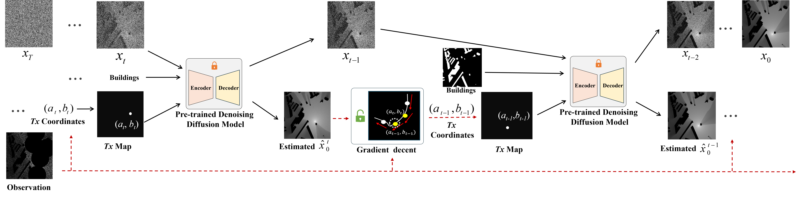
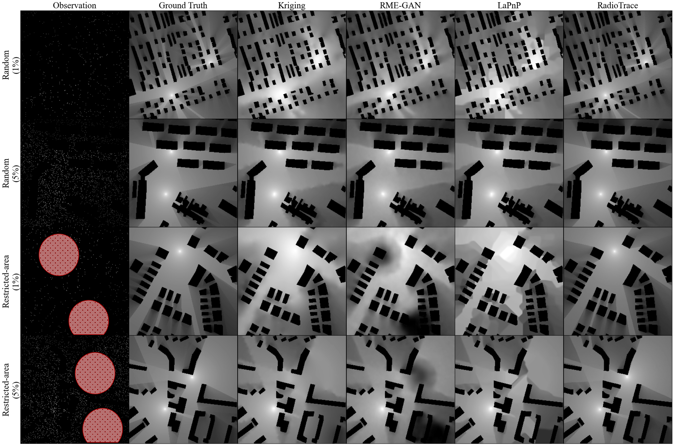

# RadioTrace: Transmitter-Aware Diffusion for Training-Free Radio Map Estimation



This repository provides code for RadioTrace, a training-free radio map estimation framework that reconstructs RSS radio maps from sparse measurements by integrating a pre-trained diffusion prior with transmitter location estimation inside the denoising loop. An optional propagation-guided K-means initialization improves robustness under restricted-area sampling.

---

## Results



## Quick Start

### 0) Prepare the environment
```
conda create -y -n radiotrace python=3.13 -c conda-forge
conda activate radiotrace
pip install -r requirements.txt
```

### 1) Download and place the dataset (RadioMapSeer)

1. Download [RadioMapSeer](https://radiomapseer.github.io/).
2. Unzip it into the repository root directory.

---

### 2) Download the pretrained diffusion model (Google Drive)

Download the pretrained checkpoint from [Google Drive](https://drive.google.com/file/d/1dsWn_9KrACaZVVbgT1SSb3-xbY_Bvwmw/view?usp=drive_link) and place it anywhere you prefer (recommended: `./`).

Note: The pretrained model is trained as a generic diffusion prior and does not need to see diverse sampling patterns during training. Sampling patterns are handled at inference via RadioTrace.

---

### 3) Run RadioTrace inference / testing
```
python sample_radiotrace.py \
  --data_dir path/to/dataset/ \
  --model_path path/to/model/file \
  --type restrict_wo_BS \
  --rate 0.01 \
  --cluster_init
```


---

## Optional: Train the diffusion model yourself

If you do not use a provided pretrained checkpoint, you can train the conditional diffusion model with:
`python train_cond_ddpm.py`

---

## Command-Line Arguments (inference)

- `--data_dir`  
  Path to the dataset root directory (RadioMapSeer).

- `--model_path`  
  Path to the pretrained diffusion checkpoint file (.pt / .pth).

- `--type`  
  Sampling / evaluation mode. Example used in the paper: `restrict_wo_BS` (restricted-area sampling without base-station region coverage).

- `--rate`  
  Sampling rate (e.g., 0.01 means 1% measurements are observed).

- `--cluster_init`  
  Enables propagation-guided K-means initialization for Tx coordinates to reduce poor local minima and improve robustness.

To list all options:
`python sample_radiotrace.py -h`

---

## Citation
```
@inproceedings{yang2025radiotrace,
  title={Radiotrace: Bridging Diffusion Priors and RSS Measurements for Accurate Radio Map Estimation},
  author={Yang, Liu and Li, Qiang and Cao, Zhuo and Lin, Jingran},
  booktitle={2025 IEEE 35th International Workshop on Machine Learning for Signal Processing (MLSP)},
  pages={1--6},
  year={2025},
  organization={IEEE}
}
```

```
@article{radiotrace,
  title={RadioTrace: Transmitter-Aware Diffusion for Training-Free Radio Map Estimation},
  author={TODO},
  journal={TODO},
  year={TODO}
}
```
---

## Acknowledgements

This implementation builds upon and is inspired by the [RadioDiff](https://github.com/UNIC-Lab/RadioDiff) repository:


